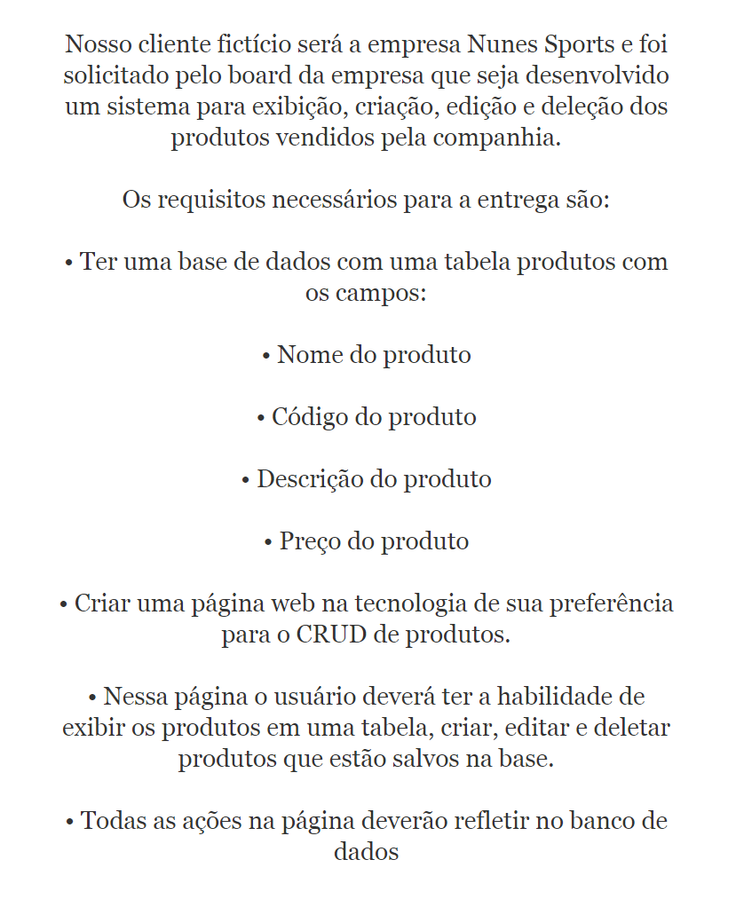

# desafio-everymind-crud

# Desafio proposto



## Node.js version

v20.10.0

## npm Modules

```bash
"body-parser": "^1.20.2",
"dotenv": "^16.3.1",
"ejs": "^3.1.9",
"express": "^4.18.2",
"sqlite": "^5.1.1",
"sqlite3": "^5.1.7"
```

## npm setup

```bash
$ npm install -y
```

## running application

```bash
$ node src/app.js
```

## routes

environment hosted at '/127.0.0.1:3000'

```javascript
'/ ' //testing route
'/produtos' //application route
```

## API Bodies

GET Route response
```JavaScript
{
    "id": 0,
    "nome": "",
    "descricao": "",
    "preco": 0.0 
}
```

POST Route request
```JavaScript
{
    "nome": "",
    "descricao": "",
    "preco": 0.0 
}
```

PUT Route request
```JavaScript
{
    "nome": "",
    "descricao": "",
    "preco": 0.0,
    "id": 0
}
```

DELETE Route request
```JavaScript
{
    "id": 0
}
```